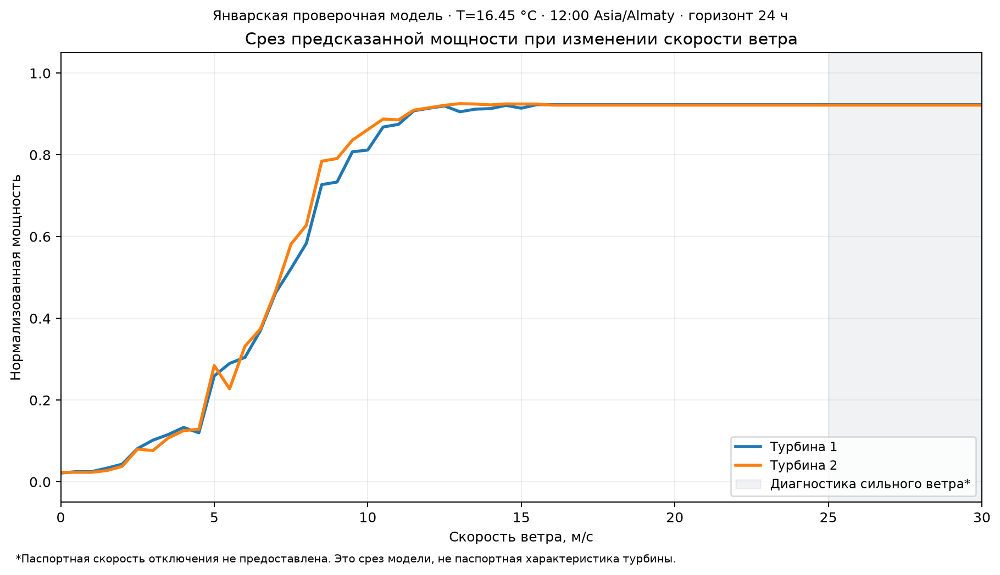

# Диагностика WindPilot на отложенном январе 2026

Проверена существующая январская модель без изменения весов, гиперпараметров и основного сплита. Две основные модели, исходная история и прежние январские результаты сохранены без изменений. Отдельное обучение на укороченной копии выполнялось только для проверки загрузки данных.

Граница обучения: `2025-12-31T18:00:00+00:00`. Целевые часы: январь 2026 по Asia/Almaty. Все метрики рассчитаны по прежним парам «момент запуска / целевой час», включая пересечения 48-часовых прогнозов; это не 1464 независимых часа. На каждую турбину приходится 744 уникальных часа.

## HTTP API

Добавлен адаптер FastAPI над прежним `run_forecast()`. `/forecast?date=2026-02-15&horizon=48&offline=true` возвращает 96 строк. `date` — первый целевой день, расчёт выполняется в 23:00 предыдущего дня местного времени. Для январских дат автоматически выбирается модель, обученная до января. Документация: `/docs`.

## 1 Смещение

Bias = mean(prediction − actual). Порог описательного флага — |bias| ≥ 0,02. Это не тест статистической значимости.

| Турбина | Пар | Bias | MAE | RMSE | Наблюдение |
|---|---:|---:|---:|---:|---|
| 1 | 1464 | +0.0892 | 0.2093 | 0.2663 | Модель систематически завышает мощность на 0.0892 |
| 2 | 1464 | +0.0902 | 0.2083 | 0.2657 | Модель систематически завышает мощность на 0.0902 |

Величины выражены в единицах нормализованной мощности; 0,01 соответствует одному процентному пункту её шкалы.

## 2 Ошибка по фактическому уровню мощности

Границы без пересечений: [0; 0,2), [0,2; 0,8), [0,8; 1]. Низкая мощность сама по себе не позволяет отличить штиль от простоя или отключения по сильному ветру.

| Турбина | Фактическая мощность | Пар | MAE |
|---|---|---:|---:|
| 1 | [0, 0.2) | 747 | 0.2152 |
| 1 | [0.2, 0.8) | 486 | 0.1866 |
| 1 | [0.8, 1] | 231 | 0.2384 |
| 2 | [0, 0.2) | 771 | 0.2159 |
| 2 | [0.2, 0.8) | 468 | 0.1799 |
| 2 | [0.8, 1] | 225 | 0.2413 |

Турбина 1: наибольшая MAE в диапазоне [0.8, 1] — 0.2384. Турбина 2: наибольшая MAE в диапазоне [0.8, 1] — 0.2413.

## 3 Прогнозная и фактическая погода

В тех же январских парах ветер и температура заменены почасовыми наблюдениями из исходных CSV. Модель, остальные признаки, время запуска, целевые часы и clipping [0,1] остаются прежними. Это диагностический эксперимент с заведомо будущими наблюдениями, а не допустимый способ рабочего прогноза.

| Турбина | MAE с прогнозом погоды | MAE с наблюдениями | Разность a − b |
|---|---:|---:|---:|
| 1 | 0.2093 | 0.1586 | +0.0508 |
| 2 | 0.2083 | 0.1645 | +0.0438 |

Турбина 1: модель на фактической погоде даёт MAE 0.1586; это согласуется с тем, что часть ошибки связана с качеством внешней погодной информации.

Турбина 2: модель на фактической погоде даёт MAE 0.1645; это согласуется с тем, что часть ошибки связана с качеством внешней погодной информации.

Это не чистая аддитивная декомпозиция ошибки: поправка модели обучена на прогнозах, замена меняет распределение входов. Прогнозный ветер взят на 100 м, высота станционного анемометра не указана. По разности MAE нельзя достоверно вычислить процент ошибки, вызванный только погодным провайдером.

## 4 Различие моделей турбин

Две модели получили одинаковые 61 набора признаков, кроме идентификатора выбора модели. Это ветер 0–30 м/с, шаг 0,5, общая температура и момент времени.

Средняя абсолютная разность сырых предсказаний: **0.010045**; максимальная: **0.062125**. Модели идентичны: **нет**.

## 5 Граничные проверки predict

Проверяется именно сырой `predict()`, а не только ограниченный агентом результат. Порог «близко к нулю» задан заранее: 0,05. Температура 5 °C, полдень по местному времени, горизонт 24 часа.

| Проверка | Статус | Результат |
|---|---|---|
| zero_wind_near_zero_and_in_range | пройдено | {"raw_predictions": [0.046840908279801266, 0.044000049582083846], "winds": [0.0]} |
| extreme_wind_25_to_30_in_range | пройдено | {"raw_predictions": [0.9693025809840846, 0.9693025809840846, 0.9693025809840846, 0.9513408088383187, 0.9513408088383187, 0.9513408088383187], "winds": [25.0, 27.5, 30.0]} |
| nan_rejected_explicitly | пройдено | Явный ForecastError для NaN в ветре, температуре, времени и turbine_id. |
| deterministic_repeated_input | пройдено | {"rows": 122, "max_absolute_difference": 0.0} |

Добавлена только проверка входов: ранее HistGradientBoosting молча возвращал числа при NaN. Теперь это явная ошибка. На корректных январских входах предсказания совпали с сохранёнными до диагностики.

## 6 Кривая мощности

Температура фиксирована на среднем **16.45 °C** из обучающей истории до сплита, полдень Asia/Almaty, горизонт 24 часа. График не является усреднённой эмпирической кривой турбины.

| Турбина | Падений до 25 м/с > 0,02 | Самое большое падение | P(0) | P(25) | P(30) |
|---|---:|---:|---:|---:|---:|
| 1 | 0 | 0.0143 | 0.0216 | 0.9227 | 0.9227 |
| 2 | 1 | 0.0569 | 0.0233 | 0.9216 | 0.9216 |

Немонотонность и отсутствие падения мощности на 25–30 м/с фиксируются как ограничения. Паспортная скорость отсечки неизвестна; её физическое соблюдение моделью не гарантируется. Бустинг имеет ступенчатую форму и не экстраполирует физику за область обучения. Модель не исправлялась по графику.

## 7 In-sample и out-of-sample

Повторно собраны те же архивные пары октября–декабря; целевые часы должны завершиться не позже исходной границы обучения. Оценивается полная двухступенчатая проверочная модель, а не финальная модель с январём в обучении.

| Турбина | Пар обучения | MAE обучения | MAE января | Январь / обучение |
|---|---:|---:|---:|---:|
| 1 | 4268 | 0.1521 | 0.2093 | 1.38 |
| 2 | 4256 | 0.1515 | 0.2083 | 1.37 |

Январская MAE примерно на 37–38% выше обучающей: разрыв есть, возможен риск переобучения. Отношение не достигает выбранного описательного порога 1,5 для большого разрыва. Вклад сезонного сдвига погоды и режимов работы этим сравнением не отделяется от переобучения.

## 8 Укороченная история и автоматические даты

**Частично:** обучение на копии успешно, автоматическое определение всех границ не реализовано.

Из копии первой турбины удалена последняя неделя: **1008** строк. Конец изменился с `2026-01-31 23:50:00` на `2026-01-24 23:50:00`. Вторая турбина оставлена целиком. Обучение вызвано без правки кода и без изменения аргументов дат; его результаты сохранены отдельно в `artifacts/diagnostics/trimmed_training/`.

Исходные файлы не изменены: подтверждено SHA-256. Основные модели не перезаписаны.

Ограничение: значения по умолчанию остаются фиксированными: `{'weather_start': '2025-10-01', 'validation_start': '2026-01-01', 'validation_end': '2026-01-31', 'final_cutoff': '2026-01-31T23:00:00+05:00'}`. Метаданные укороченной модели по-прежнему показывают заданный cutoff `2026-01-31T18:00:00+00:00`, а не последний фактически использованный час каждой турбины. Дополнительные строки после cutoff сами в обучение не попадут. Основной январский сплит не менялся.

## 9 Ручной новый запуск

Дата 15 февраля уже входила в прежнее воспроизведение. Поэтому использован новый момент `2026-02-15T13:00:00+00:00` вместо стандартных 23:00. Его отсутствие среди прежних моментов подтверждено.

Получено **96** строк, по 48 на турбину, диапазон мощности **0.1112–0.8379**, `run_id=e18946e051e96efe1d39`. Проверены временной шаг, состав полей, конечность чисел, диапазон [0,1] и повторяемость.

## Ограничения исходной оценки

Время публикации погодного выпуска оценивается консервативным лагом 12 часов. Исходное оперативное происхождение каждого исторического выпуска независимо не подтверждено; документация провайдера упоминает hindcasts для части истории. Это ограничение распространяется на все приведённые метрики. Февральских фактических мощностей нет. Метрики не являются процентом accuracy.

Воспроизведение: `.venv\Scripts\python.exe -m windpilot.diagnostics` из корня проекта. Подробные числа и контрольные суммы: `artifacts/diagnostics/diagnostics.json`.
